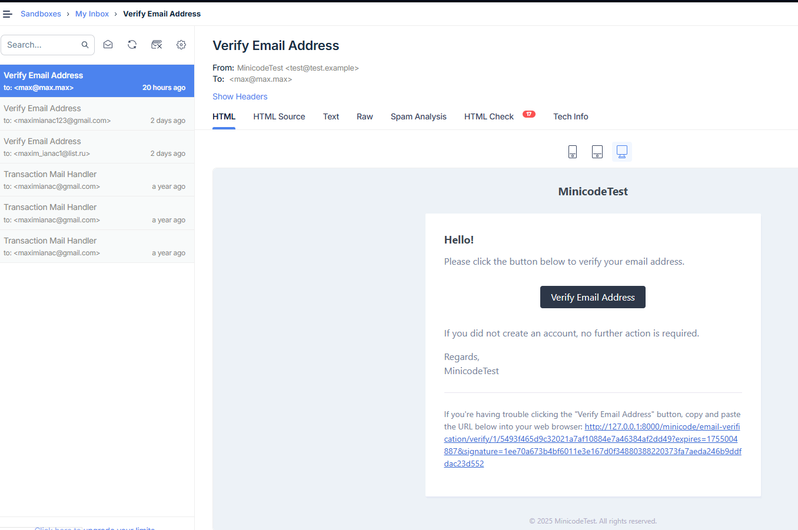
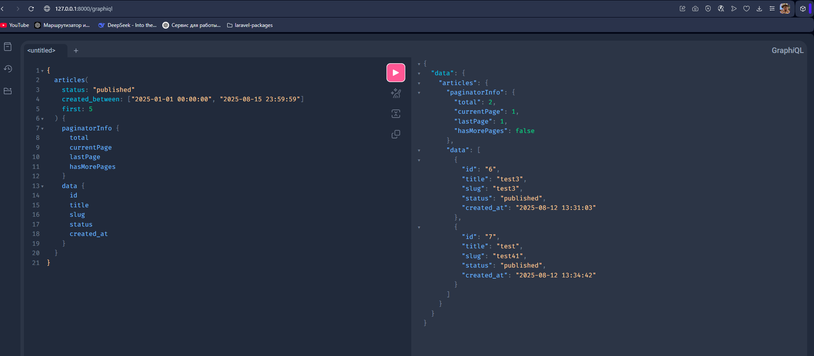

# Mini Blog (Laravel + Filament + GraphQL)

## Tech Stack & Packages

- **Laravel 11**
- **Filament v3** — admin panel for content management
- **nuwave/lighthouse** — GraphQL server for Laravel
- **Mailtrap** — used for testing email delivery (email verification)

---

### Admin Panel Access
URL: `/blog`

---

### Mailbox Preview


---

### GraphQL

The schema is located at `graphql/schema.graphql`.

**Example Query:**
```graphql
{
  articles(
    status: "published"
    created_between: ["2025-01-01 00:00:00", "2025-08-15 23:59:59"]
    first: 5
  ) {
    paginatorInfo {
      total
      currentPage
      lastPage
      hasMorePages
    }
    data {
      id
      title
      slug
      status
      created_at
    }
  }
}
```

For testing, visit: `/graphiql`


